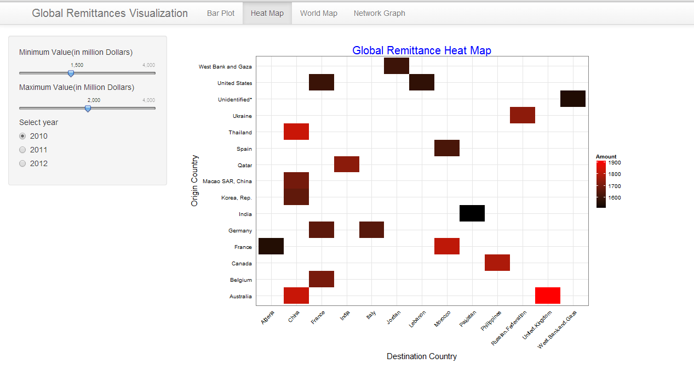
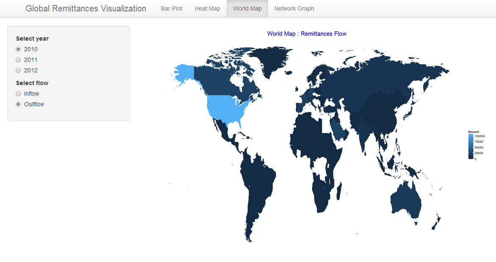
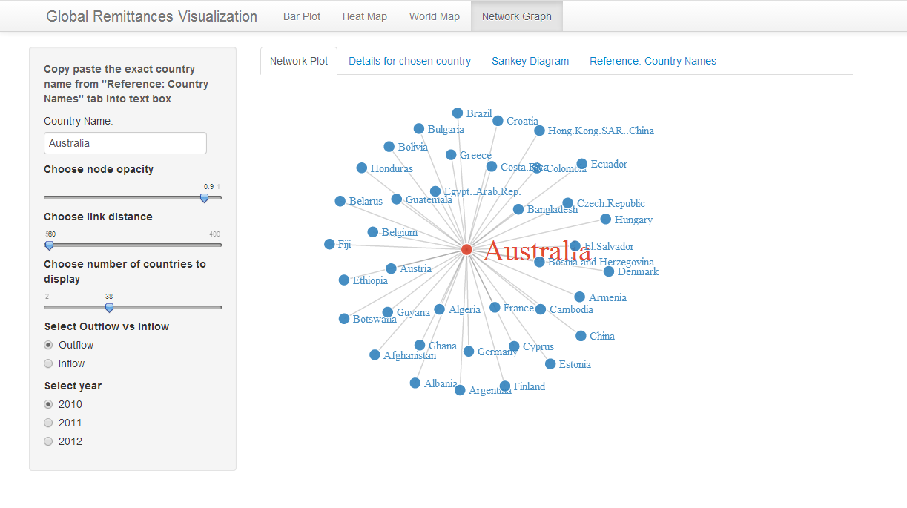
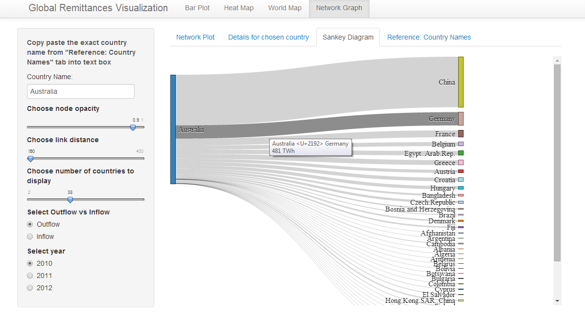

Final Project
==============================

| **Name**  | Ashish Thakur  |
|----------:|:-------------|
| **Email** | athakur2@dons.usfca.edu |

#Global Remittance Visualization#

Following R packages must be installed before running the app:

`library(d3Network)`
`library(leafletR)`
`library(ggplot2)`
`library(shiny)`
`library(sqldf)`
`library(scales)`
`library(maps)`
`library(ggmap)`
`library(reshape)`

Use the following command for running the app:
 `shiny::runGitHub('msan622', 'ashishthakur1296', subdir='final-project')`

##Introduction##

As part of practicum I am currently working for a global money transfer company and thats what got me interested into money transfers across globe. I did some research and found a UN dataset which tracks the remittances across the world for 2010-2012. Here is the link for the dataset:
 
http://econ.worldbank.org/WBSITE/EXTERNAL/EXTDEC/EXTDECPROSPECTS/0,,contentMDK:22759429~pagePK:64165401~piPK:64165026~theSitePK:476883,00.html#Remittances

I have 3 years of data from 2010-2012 about the money transfers. Its basically an excel sheet matrix of around 200 rows * 200 columns and there are 3 excel sheets in total one for each year. 

In this Project i have tried firstly to get a overall sense of data ( through visualizations like Bar Plot, Heat Map and World heatmap) and then i focused my attention on a visualization in context of a single country ( e.g. Network Visualization and Sankey diagram).

##Technique 1 - Bar Plot##

Bar Plot though simple but is a very effective visualization particularly when trying to compare multiple things. In this visualization i have tried to compare different countries to each other in terms of how much money do they send out (Outflow) and how much much money is received(Inflow) by them. For this particular visualization i decided to display the two bar plots side by side so that its easy to comprehend and for that i used fluidrows in shiny. I moved the control widgets directly below the plots and used `offset` to better position them.

I haven't done any special encoding for this particular visualization and the data is pretty much in the same form as the source. In terms of datamunging i have used `sqldf` package extensively to implement filtering throughout all the visualizations.As part of data preparation i used melt package to get the data in suitable form and then combined data for all three years into a single dataframe. I had trouble reading comma seperated dollar amounts and made somechanges in my code to account for that.

Lie factor for this particular visualization is non existent as it is in accordance with the underlying data. I have kept the data to ink ratio low and have tried to remove everything that does not carry ay information. I have removed the borders,horizontal gridlines etc. to give it a clean look. I have also used theme_bw() so that it merges well with the background and the information (bars) stand out. As far as data density is concerned it is flexible. User can interact with the visualization and pick how many countries he or she would like to see. Although there are around 200 countries in total but i have limited the number of countries to 100 ( However even at 100 it becomes uncomprehensible as things start piling on top of each other). To make the comparison easier i have displayed the bars in sorted order.

Users can pick which year they want to see and get and idea as to how much money flowed out of or in to a particular country (in aggregate) in that particular year and where does that country stand as compared to others.

By looking at this visualization one quickly learns that USA is the biggest source of remittance outflow whereas India receives the most remittances.

##Technique 2 - Heat Map##

In this visualization i have tried to take one step further and visualize the remittance relationship amongst countries. The gradient on the heatmap describes the money being transferred. The encoding is same as Technique 1 and i have used sqldf to implement filteration.

Lie factor for this visualization is low as it represents the underlying data as such. I have tried to keep the data to ink ratio low however its more than what we saw in technique 1. The chalenge i had in this particular visualization was that the data was very sparse i.e. not all 200 countries send money to each other and there are a large number of zeros in the data. As a result there are blanks in the heat map. Because of these blanks i decided against removing the background grid as it made it hard to comprehend the relationship of colored tiles to countries. Also i didnt remove the border either as it made it look awkward and visually unappealing. As usual I have used theme_bw() so that it merges well with the background and the information stand out. As far as data density is concerned it is flexible. User can interact with the visualization and pick a range of remittance amount and the corresponding countries will be displayed.

E.g. if i am interested in knowing which countries transferred between 1500 million dollar to 2000 million dollars and who were the receivers i can set my min and max sliders accordingly and the corresponding information will be displayed.

Users can pick which year they want to see and get and idea which country transferred how much money to another country.

By looking at this visualization one learns that there are a large number of countries which fall in lowere ranges (e.g. 1 MM to 500 MM) and as one starts increasing the range the number of countries start falling down (e.g. 250 MM to 500 MM). Also one can do quick Year over year comparisons for a particular range and see which new countries are there etc. One can discover many interesting things by playing around with control widgets.

In terms of data density i have kept it flexible again. It was not possible to visualize all 200+ countries simultaneously so i had used range sliders to give user flexibility to focus on a particular range and tinker around.

##Technique 3 - World Heat Map##

In this world heatmap i have represented basically the same information but instead of heatmap i have projected it on world heatmap. Another important difference from the previous heatmap is that here i have aggreagated all the money flowing into or out of a particular country whereas in the previous heatmap i had visualized money flowing from one country to another. So in other words in terms of informatiion content i am conveying basically same information as technique 1 however instead of using bar plots i have projected that on a world map.

While trying to merge data from `map` in R and my dataset i faced issues as the country names were not consistent. I corrected this problem for USA and Russia and was thus able to represent data for them. In terms of lie factor it may be a little high since i have not corrected the country name mismatch problem for some countries and they might not be represented correctly on this world map. In terms of data to ink ratio i have removed everything that didnt add any information from the plot. The data density in my opinion is low as users sees the whole information as a block and is able to spot the outliers easily.

In terms of interactivity user can look at data for different years as well as in terms of outflow and inflow.

The findings of this particular visualizations are same as technique 1 i.e. USA is the largest soource of outflow whereas India and China are the largest receivers.

##Technique 4 - Interactive Network Visualization - Single Node##

With these few next set of visualizations i have tried to focus on a particular country and its relationships with other countries.The above mentioned visualization puts the country being examined as the centre node and all other countries linked to it at its edges. It give a qualitative view of the relationship. User can pick any country he chooses from the reference list and copy paste or type it into the text box and the corresponding information will be dispayed. The visualized itself is dynamic and can be dragged across the screen. It catches the attention of the user because of its dynamic nature.

One can choose if he wants to visualise the inflow relationship or outflow relation ship as well as the year by using radio buttons. One can also choose the number of countries to be displayed as weel as choose the link length. Reducing link length is helpful when you are dealing with lots of countries and the whole visualization might not fit in the space.

This network visulaization gives a very dynamic and qualitative overview of all the inflow and outflow relationships a country might have however it still lacks information about the nature of relationship. To overcome this problem i came up with the table tab which is controlled by the same widgets as network visualization however it gives a quantitative view of the relationship being described by networ visualization. Users can flip between the two tabs and gain better understanding how a single country relates to everyone else.

I have used `d3Network` package for creating this visualization and i had to convert my data in forms of graphs for use with this package. As soon as you click on a particular node it changes color and the associated text is highlighted.

In terms of lie factor i think the lie factor is high as it does not tell the user the nature of relationship between countries. However i have tried to counter its effect by introducing a drill down table which gives exact quantitative information associated with data. For entering the country name i decided to use text box instead of a drop down as the drop down for 200+ countries was going to cover whole sidepanel and it would have been awkward to scroll through such a long list for the country user might be interested in. Instead i used text box where user can either type in or copy paste any country from the reference list provided.

In terms of data density i have kept it flexible again and user has the option to choose as many countries as he wishes as per his convenience. The data to ink ratio is pretty low in this case.

The following blog was really helpful for creating these network visualizations:
http://christophergandrud.github.io/d3Network/

##Technique 5 - Interactive Sankey Diagram##

The focus here is same as the previous visualization, however here i have tried to merge both quantitative and qualitative aspects into one single visualization. The same control widgets (with the exception of node opacity and link distance) are used for interacting with Sankey Diagrams.

As one hovers over a particular flow the corresponding amounts are displayed as tool tip. I tried hard to get rid of TWh but could not find a way to do that. I guess it's a bug in the d3Network package. Also as shown below when user changes radio button from outflow to inflow i flip the countries so that the direction of the flow remains same and its more comprehensible.

In terms of lie factor the lie factor is low as the data is being represented as such and the flow width is in proportion to the money being transferred. The data density can be managed by picking the number of countries to be displayed. The data to ink ratio is high in this particular case.

#Things that i tried that didn't work out :#
I played around with bootstrap Themes in my prototype but i couldn't get it to work with d3 Network. I also spent quite some time trying to plot my data by using leafletR package but that didn't work out either.

#What Other things i would have done if i had more time :#

I found some really cool chord diagrams on net with the same dataset and i would have tried to build something like that.
Use LeafletR world map is another thing that i would have tried.