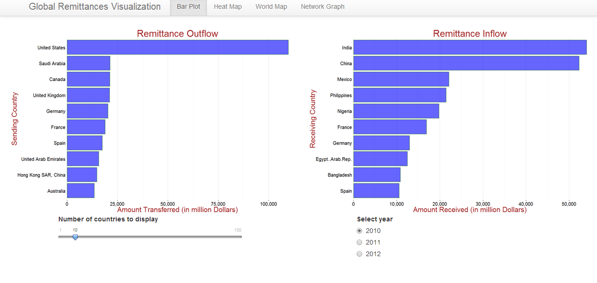

Final Project
==============================

| **Name**  | Ashish Thakur  |
|----------:|:-------------|
| **Email** | athakur2@dons.usfca.edu |

#Global Remittance Visualization#

Following R packages must be installed before running the app:

`library(d3Network)`
`library(leafletR)`
`library(ggplot2)`
`library(shiny)`
`library(sqldf)`
`library(scales)`
`library(maps)`
`library(ggmap)`
`library(reshape)`

Use the following command for running the app:
 `shiny::runGitHub('msan622', 'ashishthakur1296', subdir='final-project')`

##Introduction##

As part of practicum I am currently working for a global money transfer company and thats what got me interested into money transfers across globe. I did some research and found a UN dataset which tracks the remittances across the world for 2010-2012. Here is the link for the dataset:
 
http://econ.worldbank.org/WBSITE/EXTERNAL/EXTDEC/EXTDECPROSPECTS/0,,contentMDK:22759429~pagePK:64165401~piPK:64165026~theSitePK:476883,00.html#Remittances

I have 3 years of data from 2010-2012 about the money transfers. Its basically an excel sheet matrix of around 200 rows * 200 columns and there are 3 excel sheets in total one for each year. 

In this Project i have tried firstly to get a overall sense of data ( through visualizations like Bar Plot, Heat Map and World heatmap) and then i focused my attention on a visualization in context of a single country ( e.g. Network Visualization and Sankey diagram).

##Technique 1 - Bar Plot##

Bar Plot though simple but is a very effective visualization particularly when trying to compare multiple things. In this visualization i have tried to compare different countries to each other in terms of how much money do they send out (Outflow) and how much much money is received(Inflow) by them. For this particular visualization i decided to display the two bar plots side by side so that its easy to comprehend and for that i used fluidrows in shiny. I moved the control widgets directly below the plots and used `offset` to better position them.

I haven't done any special encoding for this particular visualization and the data is pretty much in the same form as the source. In terms of datamunging i have used `sqldf` package extensively to implement filtering throughout all the visualizations.As part of data preparation i used melt package to get the data in suitable form and then combined data for all three years into a single dataframe. I had trouble reading comma seperated dollar amounts and made somechanges in my code to account for that.

Lie factor for this particular visualization is non existent as it is in accordance with the underlying data. I have kept the data to ink ratio low and have tried to remove everything that does not carry ay information. I have removed the borders,horizontal gridlines etc. to give it a clean look. I have also used theme_bw() so that it merges well with the background and the information (bars) stand out. As far as data density is concerned it is flexible. User can interact with the visualization and pick how many countries he or she would like to see. Although there are around 200 countries in total but i have limited the number of countries to 100 ( However even at 100 it becomes uncomprehensible as things start piling on top of each other). To make the comparison easier i have displayed the bars in sorted order.

Users can pick which year they want to see and get and idea as to how much money flowed out of or in to a particular country (in aggregate) in that particular year and where does that country stand as compared to others.

Technique 2 - Heat Map
Technique 3 - World Heat Map
Technique 4 - Network Visualization - Single Node
Technique 5 - Sankey Diagram
Technique 6 - Network Visualization - Multi Node

Things that i tried that didn't work out :
Theme
LeafletR

Challenges:
Inconsistent Names between in maps package and dataset
Getting rid of the commas in values
Data Munging

What Other things i would have done if i had more time :

Chord Diagrams
Use LeafletR world map