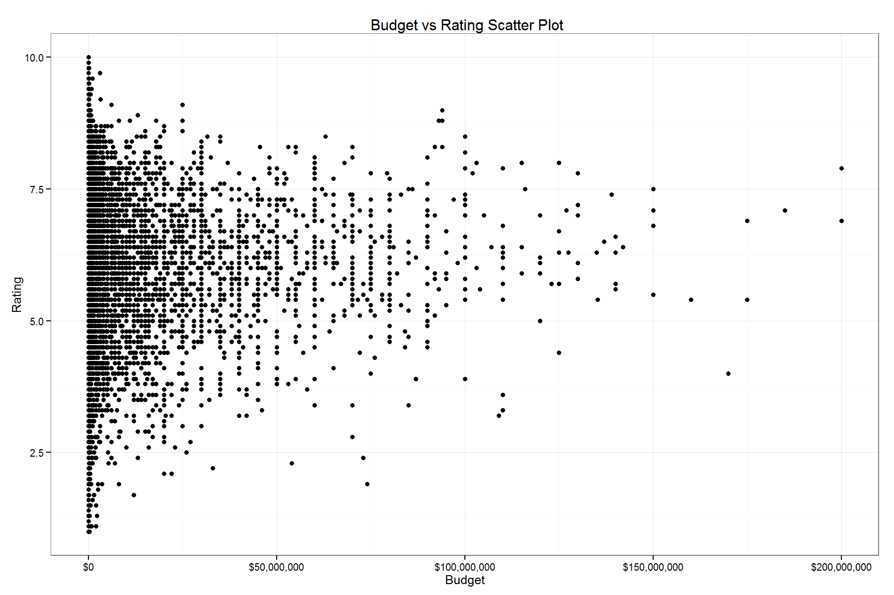
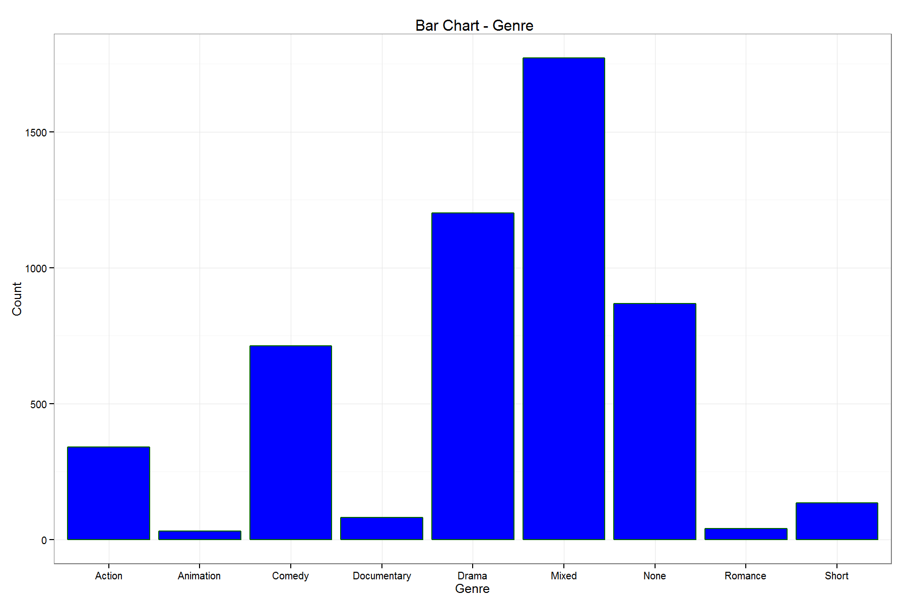
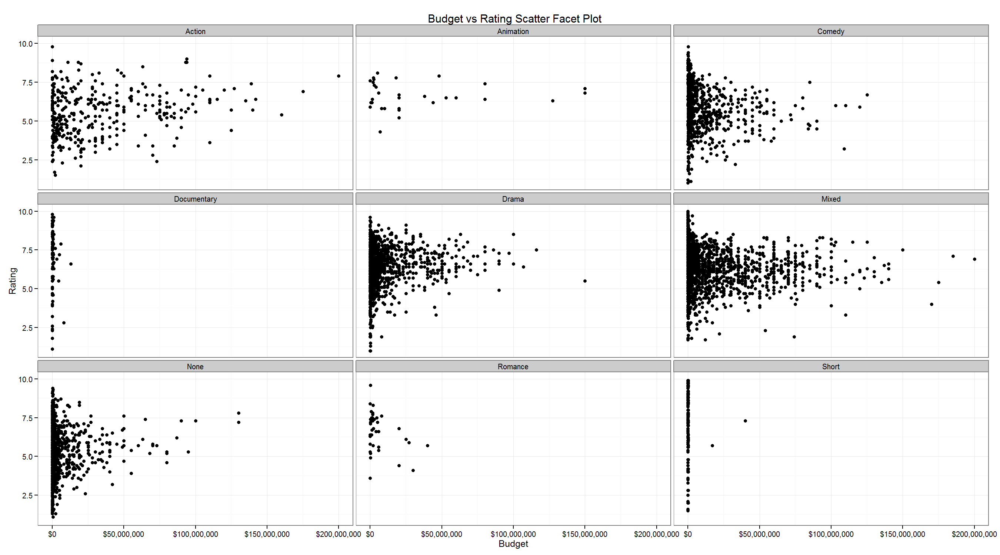
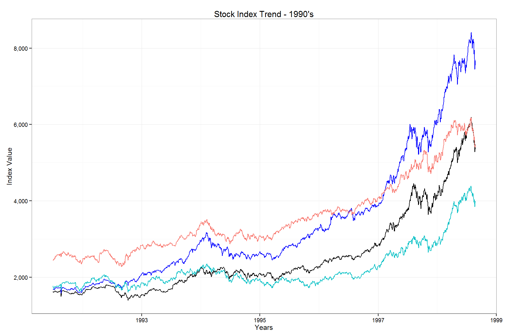

Homework 1: Basic Charts
==============================

| **Name**  | ASHISH THAKUR  |
|----------:|:-------------|
| **Email** | athakur2@dons.usfca.edu |

## Instructions ##

Following packages should be installed before running this code:
- `ggplot2`
-  'sqldf'
-  'scales'

I feel more comfortable using sql as compared to native r functions for data manipulations thats why i have used sqldf package.

## Discussion ##

###Plot 1: Scatterplot

###Plot 2: Bar Chart

###Plot 3: Small Multiples

###Plot 4: Multi-Line Chart

