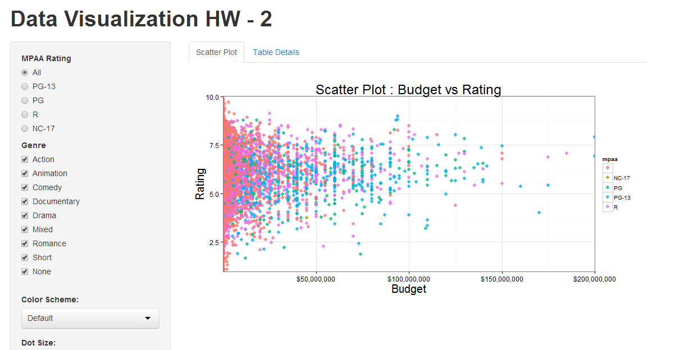
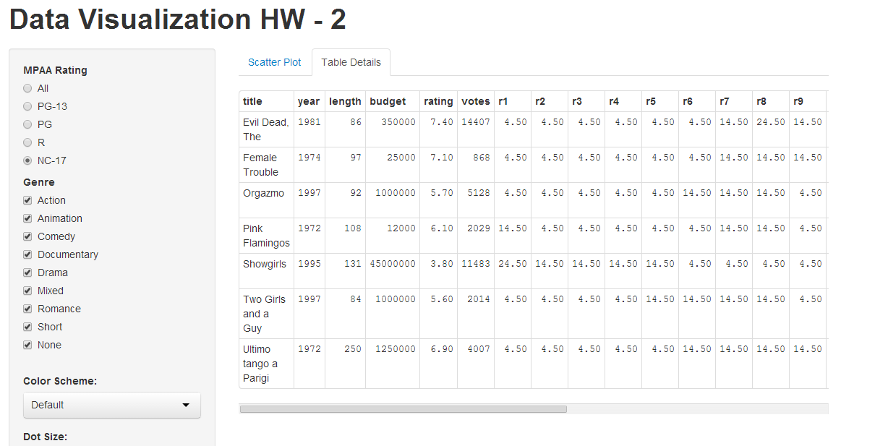

Homework 2: Interactivity
==============================

| **Name**  | Ashish Thakur  |
|----------:|:-------------|
| **Email** | athakur2@dons.usfca.edu |

## Instructions ##

The following packages must be installed prior to running this code:

- `ggplot2`
- `shiny`
- `sqldf`
- `RcolorBrewer`
- `scales`

To run this code, please enter the following commands in R:

```
library(shiny)
shiny::runGitHub('msan622', 'ashishthakur1296', subdir='homework2')
```

This will start the `shiny` app. See below for details on how to interact with the visualization.

## Discussion ##

I built on top of the shiny demo that you had shared as part of the class. This particular app has two tabs

- Tab 1 contains the scatter plot 



- Tab 2 contains the corrsponding  table



The idea is that the user first gets a visual sense of how the data is distributed and for specific details he can use tab2 with tabular data.
Both scatter plot and table get updated as the filters are changed and thus the two tabs are in sync.

When in default mode i.e. with no filters applied it takes a while for the whole table to appear however with filters applied it works pretty fast.

## Additional Customizations : ##

1) I have used `theme_bw()` as it give a nice white background and makes the colored dots stand out more prominently irrespective of the palette used. 
Also i find it aesthetically more pleasing as it gels well with the page background.

2) I got rid of margins along the axis by using `expand`.

3) The x axis has been formatted by using `dollar` labels from scale to get the corresponding currencies displayed as well.

4) In the UI script i have made the widget headings `strong` to make it more prominent.

5) Also the width of the sidebar panel has been adjusted  so that the plots get more space in display. By default it was occupying a lot of unneccesary space.

6) I have added the download link which takes the user to the source code for this app.

7) For many records mpaa ratings are blank. I was planning to replace all the blanks with something like 'Not Available' but then decided against it as i'll 
   end up changing the underlying data and it will not be entirely accurate.
