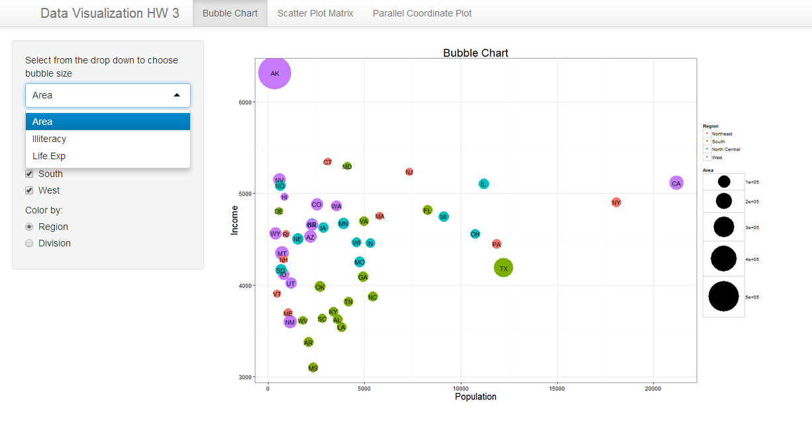
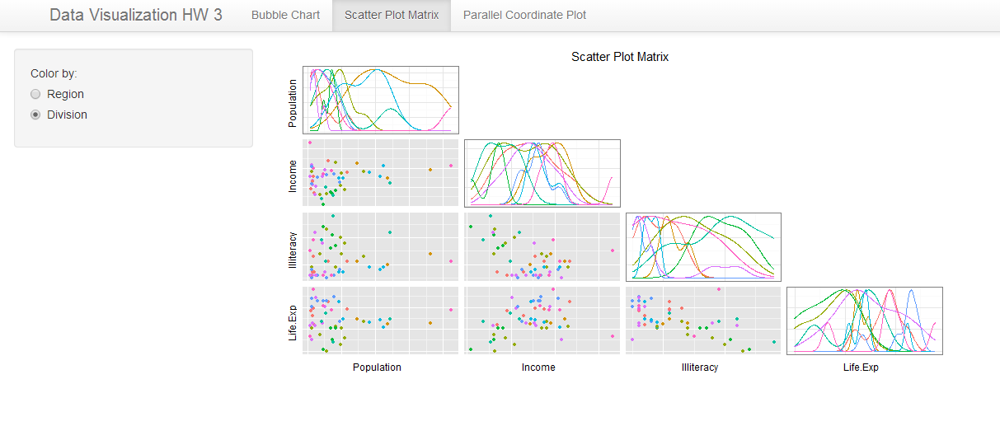
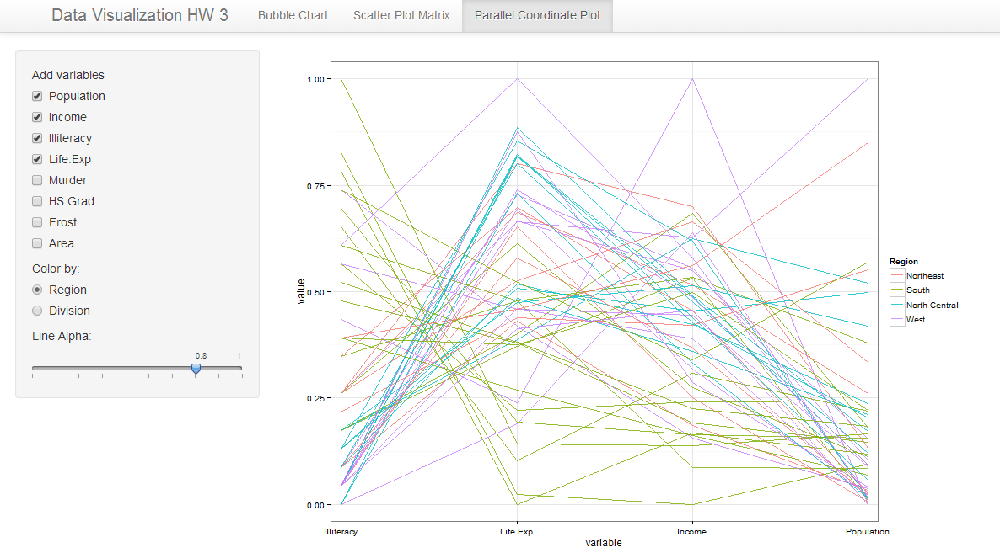

Homework 3: Multivariate
==============================

| **Name**  | Ashish Thakur  |
|----------:|:-------------|
| **Email** | athakur2@dons.usfca.edu |

## Instructions ##

The following packages must be installed prior to running this code:

- `ggplot2`
- `shiny`
- `sqldf`
- `RcolorBrewer`
- `scales`


To run this code, please enter the following commands in R:

```
library(shiny)
shiny::runGitHub('msan622', 'ashishthakur1296', subdir='homework3')
```

This will start the `shiny` app. See below for details on how to interact with the visualization.

## Discussion ##

This particular app has three tabs

- Navigation Tab 1 contains the bubble plot :



- Navigation Tab 2 contains the Scatter Matrix plot



- Navigation Tab 3 contains the Parallel plot




## Additional Customizations : ##

1) I have used `theme_bw()` as it give a nice white background and makes the colored dots stand out more prominently irrespective of the palette used. 
Also i find it aesthetically more pleasing as it gels well with the page background.

2) I got rid of margins along the axis by using `expand`.

3) Also the width of the sidebar panel has been adjusted  so that the plots get more space in display. By default it was occupying a lot of unneccesary space.

4) In the bubble plot i have filtered the data based on regions. The same filter is applied across to scattermatrix plot as well.

5) In the Bubble plot user can dynamically change the size of the bubble to correspond with any quantity he picks from drop down menu.

6) Similarly in Parallel plot users can dynamically add additional cooordinate axis. Also user has the choice how he wants to color the lines.
