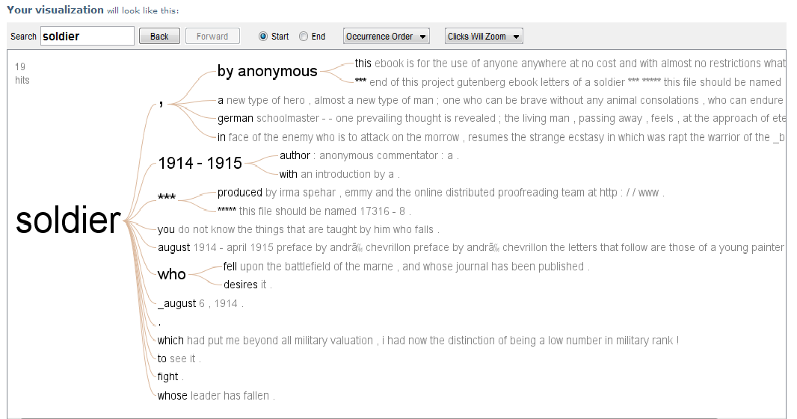

Homework 4: 
==============================

| **Name**  | Ashish Thakur  |
|----------:|:-------------|
| **Email** | athakur2@dons.usfca.edu |

## Instructions ##

The following packages must be installed prior to running this code:

- `ggplot2`
- `tm`
- `SnowBallC`
- `RcolorBrewer`
- `wordcloud'

To run this code, please source the hw4.r file in R and download the sotu directory in the source directory:

## Discussion ##

I have used `theme_bw()` as it give a nice white background and makes the words stand out more prominently.Also i find it aesthetically more pleasing as it gels well with the page background. I have also removed the axis tick marks as it improves the data to ink ratio by removing unneccesary details. I also increased the font size of the axis labels and title as it makes it more readable. I chose the state of union sppeches from 1960's as my source dataset as JF Kennedy is one of my favorite leaders and i wanted to visualize what stands out in his speeches. The sotu directory contains three speeches from 1961 to 196 and here i have compared only two of them(1961-1962).

From a lie factor perspective there certainly is some liefactor as its hard to tell the exact frequency of the words from the plot because the words themselves occupy some space and we cannot tell the exact frequency just by looking at the plot.Also jitter setting have been used while creating the plot which also add to lie factor.

Data density of this particular plot is low as we have plotted only few words and we can easily make out which are the most prominent words. I have kept a aspect ratio of 1:1 so that its easy to compare the two speeches.

By looking at this comparison plot we find out that JFK's speeches in 1961 and 1962 used words like 'new' and 'nation' a lot of times. Also word 'world' and 'must' has been used frequently. In my biased view ( like i earlier mentioned he's my favorite leader) JFK's speeches are largely about looking towards the 'new' future, 'nation' building, holistic 'world' view and idealistic actions that 'must' be taken.

The word cloud is based on all three speeches from 1961-1963.

I picked a book titled `Letters of a Soldier` from project gutenberg for this visualization.
Here is the link to the source data:

`http://www.gutenberg.org/cache/epub/17316/pg17316.txt`

Here is the link to the visualization:

`http://www-958.ibm.com/software/analytics/manyeyes/visualizations/soldier`

