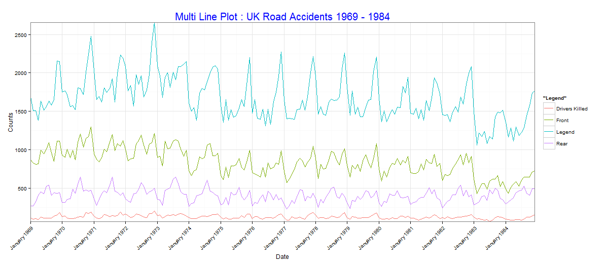
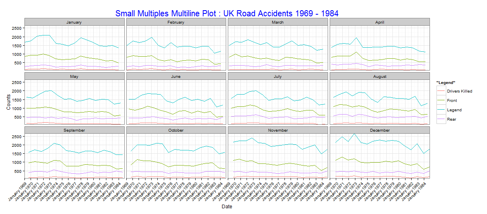
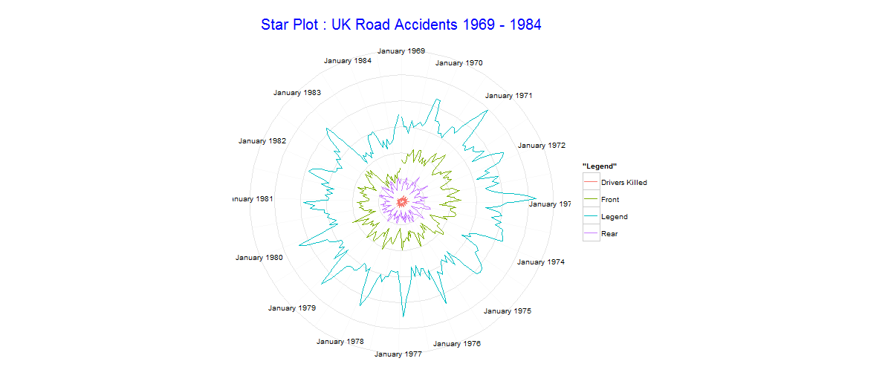
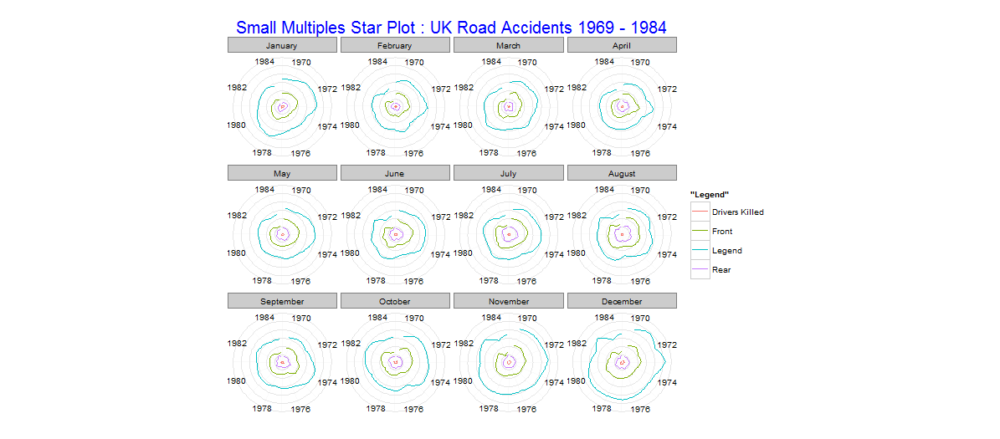
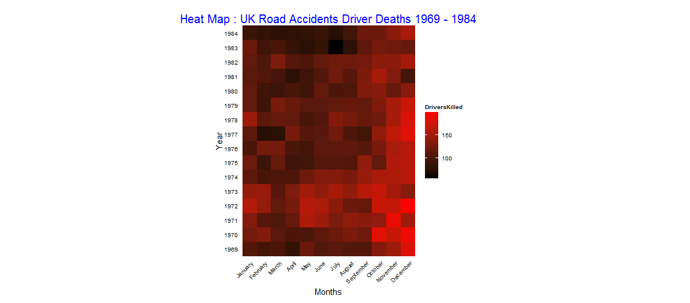
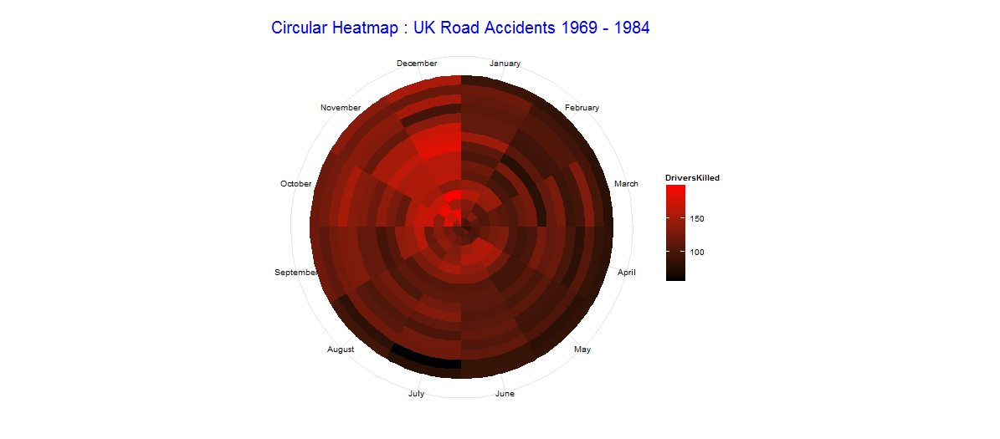

Homework 5: 
==============================

| **Name**  | Ashish Thakur  |
|----------:|:-------------|
| **Email** | athakur2@dons.usfca.edu |

## Instructions ##

The following packages must be installed prior to running this code:

- `ggplot2`
- `Scales`

To run this code, please source the `temporal.r` file in R.

## Discussion ##
I have used following techniques in this assignment:
	`Multi Line Plot`
	`Small Multiples Multi Line Plot`
	`Star Plot`
	`Small Multiples Star Plot`
	`Heat Map`
	`Circular Heatmap`

I have also used `theme_bw()` as it give a nice white background and makes the visualization stand out more prominently.Also i find it aesthetically more pleasing as it gels well with the page background. I have also removed the axis tick marks as it improves the data to ink ratio by removing unneccesary details. I also increased the font size of the axis labels and title as it makes it more readable. I chose the `DriversKilled` field for my analysis and plotted it in different ways.From a lie factor perspective the lie factor appears to be low in all of these visualizations as we have not distorted anything.

Here is the Multiple Line Plot

Here is the Small Multiples Line Plot

Here is the star plot:

Here is the small multiples star plot:

Here is the Heat Map:

Here is the Circular Heat Map:

## Additional Customizations ##

-For the multiline Plot i was having trouble to display the year month horizontally so i tilted x axis labels at 45 degrees.
 
-Changed Legend headings, removed axis tick marks from heatmaps, removed extra space from the axis by using `expand`, supressed y axis labels on star plots

-Adjusted title and axes text sizes and altered the coordinate ratio of heatmaps to make it more aesthetically pleasing.

