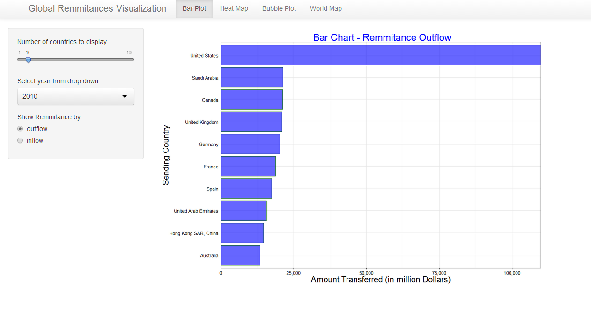

Homework 5: 
==============================

| **Name**  | Ashish Thakur  |
|----------:|:-------------|
| **Email** | athakur2@dons.usfca.edu |

## Instructions ##

The following packages must be installed prior to running this code:

- `ggplot2`
- `Scales`
- `sqldf`

## Discussion ##

# Data Description #

This data is related to international migration and global remmitances. I pulled this data from UN Sites and here are the links :
http://econ.worldbank.org/WBSITE/EXTERNAL/EXTDEC/EXTDECPROSPECTS/0,,contentMDK:22759429~pagePK:64165401~piPK:64165026~theSitePK:476883,00.html#Remittances

I am currently doing internship at a global money transfer company and thats what got me interested into money transfers across globe. I guess it would be interesting to visualize how the money is flowing vis a vis how the people are moving across countries.
 
I have 3 years of data from 2010-2012 about the money transfers.
Its basically an excel sheet matrix of around 300 rows * 300 columns and there are 3 excel sheets in total one for each year.

Here are few ideas that i am toying around with as of now:

1) Barplot - Barplot though simple but will give a very clear picture of the money being trnaferred. Initially I planned to have a drop down based on origin country and barplot will plot sorted bars of target countries where money was transferred however off late i have abandoned this idea because there are around 217 countries in total and it would be a little too messy. Instead i am planning to use inflow and outflow as two characterstics.Users can play around an explore data and find out how the outflow and inflow trend looks.

2) Heat Map - Using heatmap I plan to give a snense of how much money is transferred to particular countries. I am planning to divide countries into region and then let users give the flexibility to switch to region wise view instead of countries view if they so desire.

3) Multi Line plot - I have data for last 3 years and the user will be able to discover how the money transfer trends look within last three years. We'll be able to discover if for some countries the remmitances are increasing over a period of time or if they are decreasing.

4) World HeatMap : I amplanning to plot a heatmap on the worldmap and by varying the color intensity based on eithe outflow of money or inflow. User can interact by choosing a color scheme based on either inflow or out flow.

For this prototype i have used only a simple bar plot. I have added some basic interactivity to it.

Here is how it looks :

I have also used `theme_bw()` as it give a nice white background and makes the visualization stand out more prominently.Also i find it aesthetically more pleasing as it gels well with the page background. I have also removed the axis tick marks as it improves the data to ink ratio by removing unneccesary details. I also increased the font size of the axis labels and title as it makes it more readable. 

